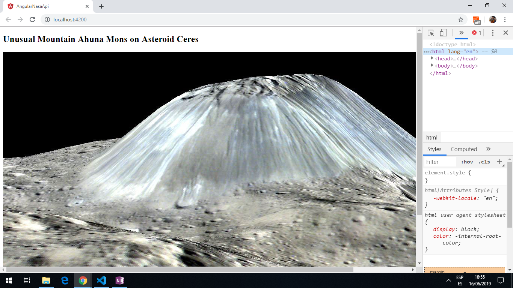
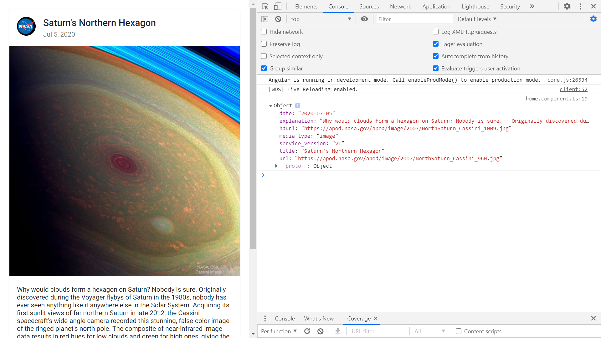

# :zap: Angular NASA API

* App using Angular 10, to view data from the official [NASA API](https://api.nasa.gov/index.html#getting-started). Uses Angular Material Card to display image with buttons and credit text below. App to be deployed to Google Cloud Run using a Docker image (in progress).

*** Note: to open web links in a new window use: _ctrl+click on link_**

## :page_facing_up: Table of contents

* [:zap: Angular NASA API](#zap-angular-nasa-api)
  * [:page_facing_up: Table of contents](#page_facing_up-table-of-contents)
  * [:books: General info](#books-general-info)
  * [:camera: Screenshots](#camera-screenshots)
  * [:signal_strength: Technologies](#signal_strength-technologies)
  * [:floppy_disk: App Setup](#floppy_disk-app-setup)
  * [:floppy_disk: Docker Setup](#floppy_disk-docker-setup)
  * [:computer: Code Examples](#computer-code-examples)
  * [:cool: Features](#cool-features)
  * [:clipboard: Status & To-Do List](#clipboard-status--to-do-list)
  * [:clap: Inspiration](#clap-inspiration)
  * [:envelope: Contact](#envelope-contact)

## :books: General info

* The NASA Picture of the Day is displayed.
* [NASA apod API github repo](https://github.com/nasa/apod-api)

## :camera: Screenshots

.
.

## :signal_strength: Technologies

* [Angular v10](https://angular.io/)
* [RxJS Library v6](https://angular.io/guide/rx-library) used to [subscribe](http://reactivex.io/documentation/operators/subscribe.html) to the API data [observable](http://reactivex.io/documentation/observable.html).
* [Angular Material v10](https://material.angular.io/)

## :floppy_disk: App Setup

* Install dependencies with `npm i`
* Get yourself a [NASA API key](https://api.nasa.gov/index.html#getting-started) from Nasa and add it to your environment config files
* Run `ng serve` for a dev server and navigate to `http://localhost:4200/`. The app does automatically reload if you change any of the source files

## :floppy_disk: Docker Setup

* For Docker to be able to be used on Windows 10 Home I had to install an Oracle VirtualBox virtual machine

## :computer: Code Examples

* `nasa.service.ts` extract: gets data from Nasa API using APIKEY supplied by them.

```typescript
getNasaImage(): Observable<string> {
  const year = new Date().getFullYear();
  const month = new Date().getMonth() + 1;
  const day = new Date().getDate();
  const apiKey = 'APIKEY';
  const apodUrl = `https://api.nasa.gov/planetary/apod?date=${year}-${month}-${day}&api_key=${apiKey}&hd=true`;
  console.log(apodUrl);
  return this.http.get<string>(apodUrl);
}
```

## :cool: Features

* The NASA API requires a date in the format YYYY-MM-DD. Hence the app `nasa.service` uses the [getFullYear()](https://developer.mozilla.org/en-US/docs/Web/JavaScript/Reference/Global_Objects/Date/getFullYear), [getMonth()](https://developer.mozilla.org/en-US/docs/Web/JavaScript/Reference/Global_Objects/Date/getMonth) and the [getDate()](https://developer.mozilla.org/en-US/docs/Web/JavaScript/Reference/Global_Objects/Date/getDate) methods from the javascript Date.prototype.

## :clipboard: Status & To-Do List

* Status: Working and deployed to Github. Docker virtual environment not working on Windows Home. All dependencies updated
* To-Do: Revisit Docker

## :clap: Inspiration

* NASA :-)
* Mercury :-)
* [How to run Docker on Windows 10 Home edition](https://www.freecodecamp.org/news/how-to-run-docker-on-windows-10-home-edition/)
* [Docker for windows 10 home](https://www.youtube.com/watch?v=Gtid21ZOqpM)

## :envelope: Contact

* Repo created by [ABateman](https://www.andrewbateman.org) - you are welcome to [send me a message](https://andrewbateman.org/contact)
