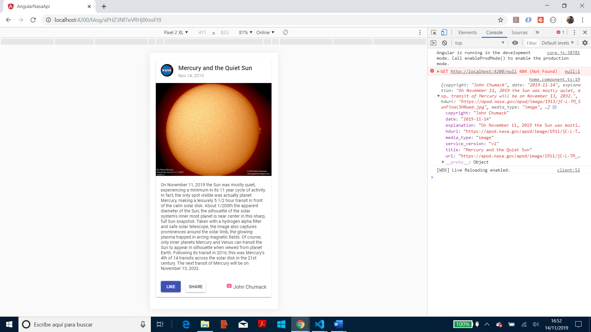

# Angular NASA API

* App using Angular 8, to view data from the official [NASA API](https://api.nasa.gov/index.html#getting-started). Uses Angular Material Card to display image with buttons and credit text below. 

*** Note: to open web links in a new window use: _ctrl+click on link_**

## Table of contents

* [General info](#general-info)
* [Screenshots](#screenshots)
* [Technologies](#technologies)
* [Setup](#setup)
* [Features](#features)
* [Status](#status)
* [Inspiration](#inspiration)
* [Contact](#contact)

## General info

* The NASA Picture of the Day is displayed.

* [NASA apod API github repo](https://github.com/nasa/apod-api)

## Screenshots

.

## Technologies

* [Angular v8.0.0](https://angular.io/)

* [Angular CLI v8.0.1](https://cli.angular.io/).

* [RxJS Library v6.4.2](https://angular.io/guide/rx-library) used to [subscribe](http://reactivex.io/documentation/operators/subscribe.html) to the API data [observable](http://reactivex.io/documentation/observable.html).

* [Angular Material v8.2.0](https://material.angular.io/)

## Setup

Run `ng serve` for a dev server. Navigate to `http://localhost:4200/`. The app does automatically reload if you change any of the source files.

## Code Examples

* `nasa.service.ts` extract: gets data from Nasa API using APIKEY supplied by them.

```typescript
getNasaImage(): Observable<string> {
  const year = new Date().getFullYear();
  const month = new Date().getMonth() + 1;
  const day = new Date().getDate();
  const apiKey = 'APIKEY';
  const apodUrl = `https://api.nasa.gov/planetary/apod?date=${year}-${month}-${day}&api_key=${apiKey}&hd=true`;
  console.log(apodUrl);
  return this.http.get<string>(apodUrl);
}
```

## Features

* The NASA API requires a date in the format YYYY-MM-DD. Hence the app `nasa.service` uses the [getFullYear()](https://developer.mozilla.org/en-US/docs/Web/JavaScript/Reference/Global_Objects/Date/getFullYear), [getMonth()](https://developer.mozilla.org/en-US/docs/Web/JavaScript/Reference/Global_Objects/Date/getMonth) and the [getDate()](https://developer.mozilla.org/en-US/docs/Web/JavaScript/Reference/Global_Objects/Date/getDate) methods from the javascript Date.prototype.

## Status & To-Do List

* Status: Working.

* To-Do: Add functionality.

## Inspiration

* NASA :-)

* Mercury :-)

## Contact

Repo created by [ABateman](https://www.andrewbateman.org) - feel free to contact me!
